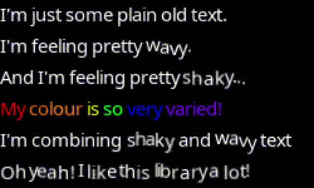

# What is Lovetext?

This is a lightweight* text engine I've created for Love2D, mainly intended on being used for Lovepotion.


I made this as I was disappointed by the lack of text rendering options for the platform, and wanted to change that.

*This project hasn't been fully optimised yet and as such may run poorly on old 3ds models.

# Example

```lua
lovetext = require('lovetext')

function love.load()
    text = lovetext.new("Who says text can't be <wave>animated?</wave>")
end

function love.update(dt)
    lovetext.update(dt)
end

function love.draw()
    text:draw()
end
```



1. [How To Use](#how-to-use)
2. [Updating Lovetext Objects](#updating-lovetext-objects)  
3. [Using Tags](#using-tags)  
4. [Customisation](#customisation)  
5. [Cleaning Up](#cleaning-up)

# How To Use:

The way you can begin using lovetext is very simple!

After importing lovetext through the following:

```lua
lovetext = require('path/to/lovetext')
```
You can immediately begin creating text objects through the following:

```lua
text = lovetext.new("your text here", font)
```

If you ever need to send additional text to an existing lovetext object, instead of creating a new object, you can simply use the following function:

```lua
text:send("additional text here")
```

Once your text objects are ready, you can render them through:
```lua
text:draw(x, y, chars)
```
Where `x` and `y` are the location to draw the text object, and `chars` is the number of characters from the text to draw (useful for creating a typewriting effect).

## Updating Lovetext Objects

You can update Lovetext objects through the simple function:
```lua
lovetext.update(dt)
```
This will update all instances of Lovetext. If you would instead like to only update specific instances, simply call:
```lua
text:update(dt)
```
Which will update only the associated object.

## Using Tags

Lovetext tags are very simple, and have been designed to behave similarly to HTML tags.

For example, to make text shake, you would simply open the tag with `<shake>`, then type the text you would like to shake. When finished, type `</shake>` and all text within the tags will shake- Its that easy!

The currently supported tags include:

- Effects: `<shake>` `<wave>`

- Tones: `<default>` `<white>` `<black>`

- Colours: `<red>` `<green>` `<blue>` `<yellow>` `<orange>` `<purple>`

I'm always looking to add more, so if you have any ideas, please let me know!

## Customisation

You can add custom colours to lovetext through calling: 

```lua
lovetext.newColourTag(tag, value)
```

Where `tag` is the name that you will use to call the new colour (E.G. red) and `value` is a table containing the RGB colours of the new colour tag.

You can also use `lovetext.newColourTag()` to replace existing colour tags, such as if you want to modify the `default` colour.

### Cleaning Up

As Lovetext uses tables to hold information, if your project creates a lot of unique text objects, you may need to discard text objects that are no longer being used; but no worries at all, for Lovetext makes even this a breeze!

Simply call:
```lua
text:release()
```
This will release the called object from the list of instances.

If you would instead like to release *ALL* lovetext objects, simply call:
```lua
lovetext.clear()
```
This simple line will clear all of the currently registered lovetext objects.